# 🛡️ PySecure - Python Security Analysis System

[](https://git.io/typing-svg)

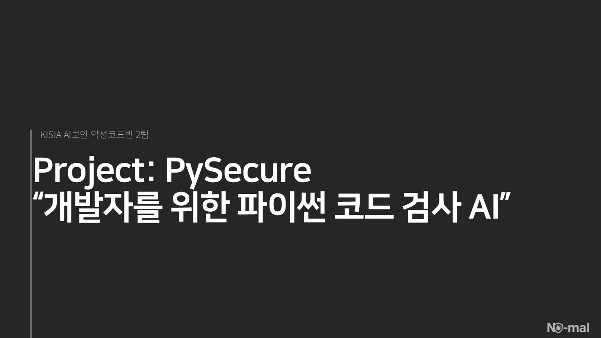

<div align="center">
    <a href="https://youtu.be/-y6QJE9Cj4s">
        [사용 동영상 가이드]
    </a>
    <br>
    <br>
    <a href="발표자료/PT-SecurePy.pdf">
        [발표자료]
    </a>
    <br>
    <br>
    <a href="server/pipeline.md">
        [상세 문서]
    </a>
</div>

## 1. 프로젝트 소개

PySecure는 Python 코드의 악성 여부 및 취약점을 다중 AI 엔진(LSTM, BERT, ML)으로 분석하고, FastAPI 기반 대시보드와 VS Code 확장을 통해 결과를 제공하는 종합 보안 분석 시스템입니다.

이 프로젝트는 개발자들이 안전한 Python 코드를 작성할 수 있도록 도와주는 AI 기반 보안 검사 도구로, PyPI 패키지의 악성코드 탐지와 취약점 분석을 실시간으로 수행합니다.

**✅ Python 3.12.10 (Release Date: April 8, 2025) 기준 테스트 완료**

<br>

## 2. 설치 가이드

https://youtu.be/-y6QJE9Cj4s

## 3. 소개 영상

[](https://youtu.be/uITb4-UTSNQ)

https://youtu.be/uITb4-UTSNQ

<br>

## 4. 프로젝트 기능

#### 1️⃣ 다중 AI 엔진 보안 분석

PySecure는 LSTM, BERT, XGBoost 등 다양한 AI 모델을 통합하여 Python 코드의 보안 취약점과 악성코드를 탐지합니다.

|LSTM 취약점 분석|BERT 악성코드 분석|ML 통합 분석|
|------|---|---|
|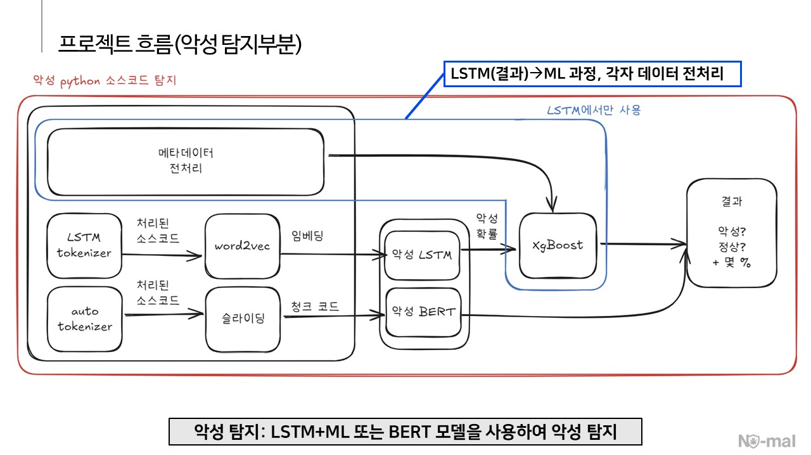|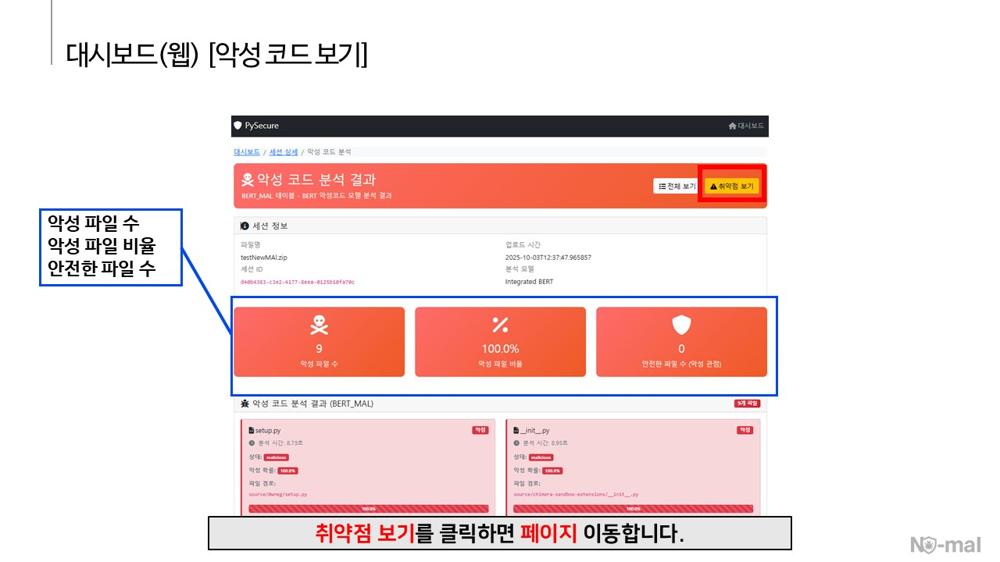|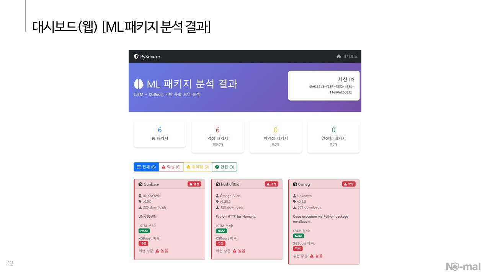|

- **LSTM 기반 분석**: 코드 패턴 학습을 통한 취약점 및 악성코드 탐지
- **BERT 기반 분석**: CodeBERT 모델을 활용한 고도화된 코드 이해 및 분석
- **ML 통합 분석**: LSTM + XGBoost를 결합한 패키지 메타데이터 기반 악성 탐지

#### 2️⃣ 실시간 웹 대시보드

FastAPI 기반의 직관적인 웹 인터페이스를 통해 분석 결과를 실시간으로 확인할 수 있습니다.

|웹 대시보드|분석 결과|소스코드 뷰어|
|------|---|---|
|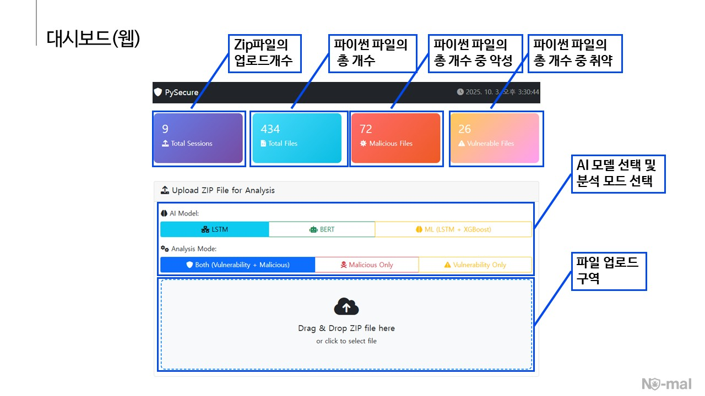|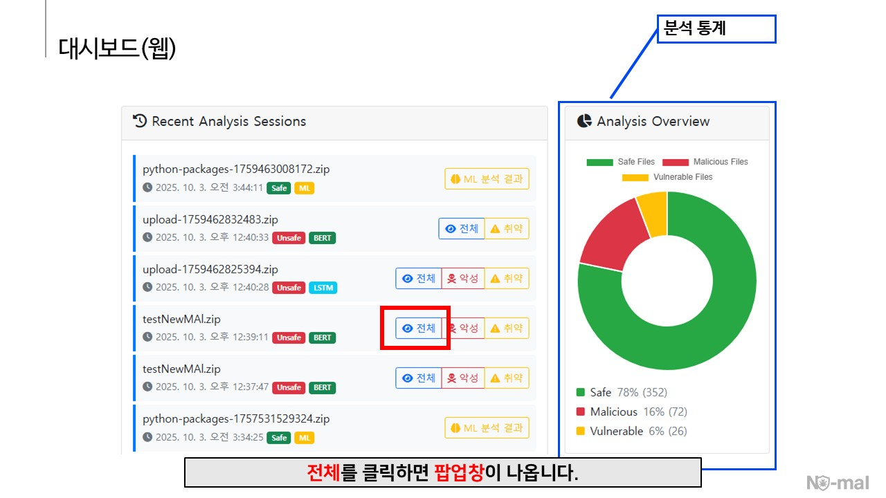|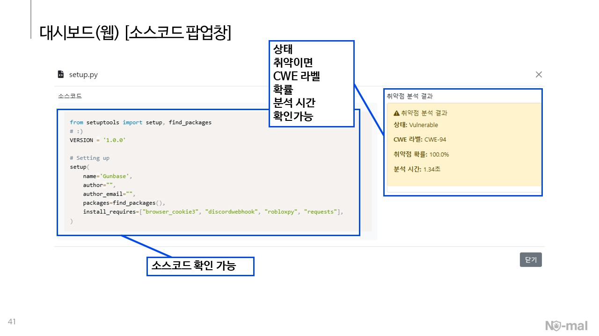|

- **대시보드**: 전체 분석 통계 및 최근 세션 목록
- **분석 결과 뷰**: 취약점/악성코드별 상세 결과 표시
- **소스코드 뷰어**: 파일 클릭 시 모달로 소스코드 표시

#### 3️⃣ VS Code 확장 프로그램

개발 환경에서 직접 사용할 수 있는 VS Code 확장 프로그램을 제공합니다.

|VS Code 확장|커맨드 분석|실시간 피드백|
|------|---|---|
|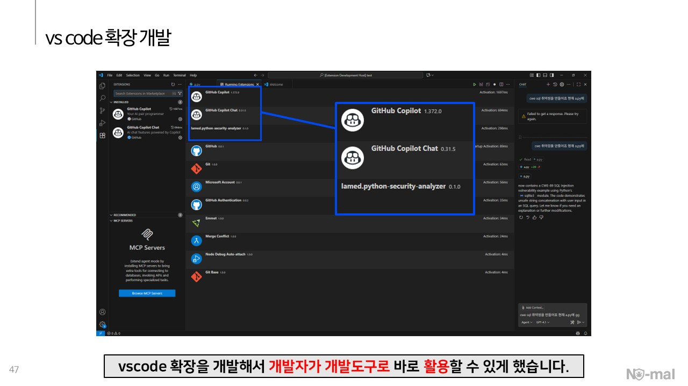|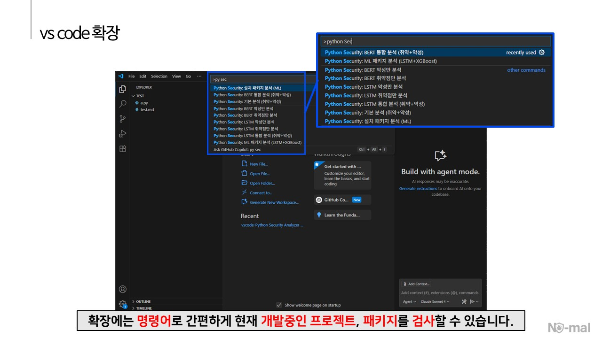|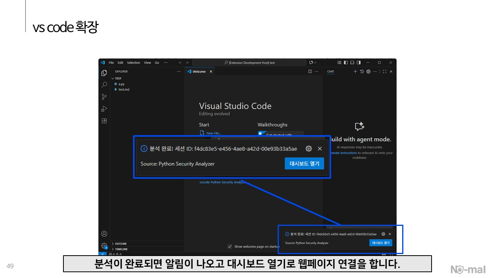|

- **커맨드 분석**: VS Code에서 폴더를 ZIP으로 압축하여 서버에 업로드
- **실시간 피드백**: 분석 결과를 VS Code 내에서 바로 확인

<br>

## 5. 팀원 소개

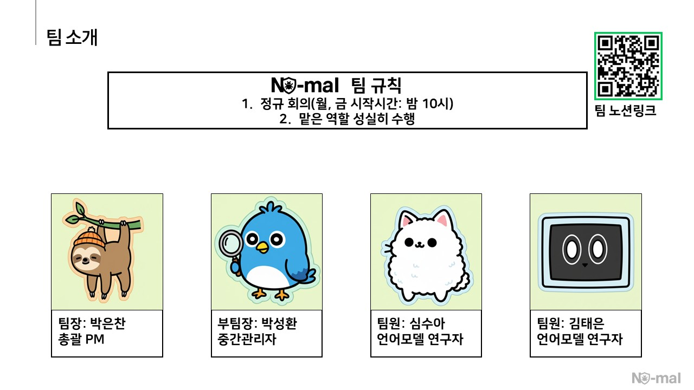

<table>
    <tr align="center">
        <td>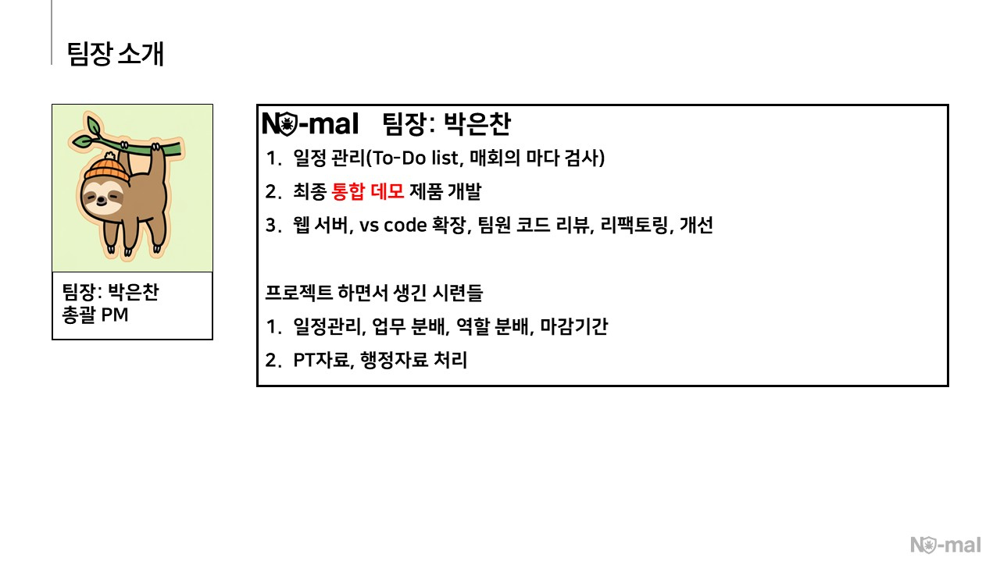</td>
        <td>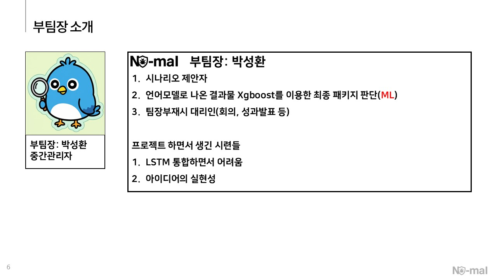</td>
        <td>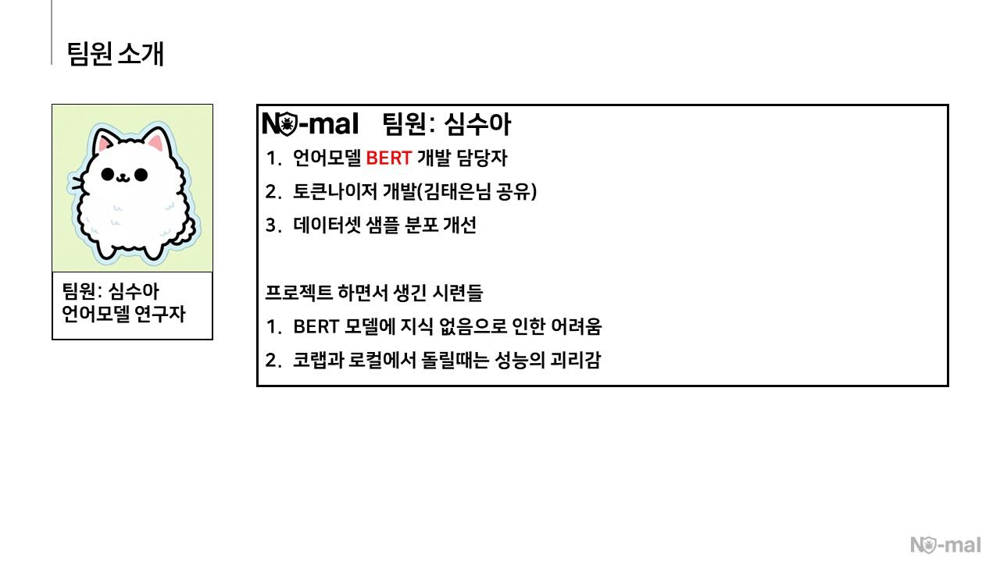</td>
        <td>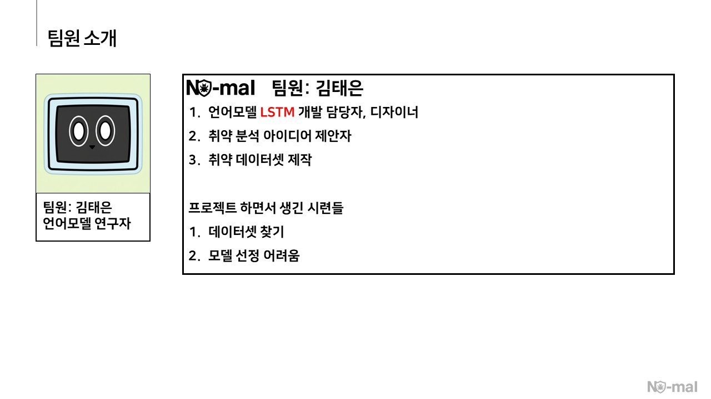</td>
    </tr>
    <tr align="center">
        <td>박은찬</td>
        <td>박성환</td>
        <td>심수아</td>
        <td>김태은</td>
    </tr>
    <tr align="center">
        <td>팀장</td>
        <td>부팀장</td>
        <td>팀원</td>
        <td>팀원</td>
    </tr>
    <tr align="center">
        <td>통합, 최종데모<br>모델개발, 웹,<br>VSCODE확장</td>
        <td>코어기능<br>ML 개발</td>
        <td>코어기능<br>BERT 개발</td>
        <td>코어기능<br>LSTM 개발</td>
    </tr>
</table>

<br>

## 6. 기술스택

### 🛠 Backend

| 역할                 | 종류                                                                                                                                                                                                                                                |
| -------------------- | --------------------------------------------------------------------------------------------------------------------------------------------------------------------------------------------------------------------------------------------------- |
| Framework            |                                                                                                                                            |
| Database             |                                                                                                                              |
| Programming Language |                                                                                                                                             |

<br />

### 🤖 AI/ML

| 역할                 | 종류                                                                                                                                                                                                                                                                                                                                                                                                                                                                                                                                                                                                                                                                                                                                                                                                                                                                                                         |
| -------------------- | ------------------------------------------------------------------------------------------------------------------------------------------------------------------------------------------------------------------------------------------------------------------------------------------------------------------------------------------------------------------------------------------------------------------------------------------------------------------------------------------------------------------------------------------------------------------------------------------------------------------------------------------------------------------------------------------------------------------------------------------------------------------------------------------------------------------------------------------------------------------------------------------------------------ |
| Deep Learning        |                                                                                                                                                                                                                                                                                                                                                            |
| Machine Learning     |                                                                                                                                                                                                                                                                                                                                                                                                                                                                                                                                                                                                                                                                    |
| NLP                  |                                                                                                                                                                                                                                                                                                                                                                                                                                                                                                                                                                                                                                                                     |
| Models               |                                                                                                                                                                                                                                                                                                                                                                                                                                                                                                                                                                                                                                                |

<br />

### 🖥 Frontend

| 역할                 | 종류                                                                                                                                                                                                                                                        |
| -------------------- | ----------------------------------------------------------------------------------------------------------------------------------------------------------------------------------------------------------------------------------------------------------- |
| Framework            |    |
| UI Library           |                                                                                                                                      |

<br />

### 🔧 Tools

| 역할            | 종류                                                                                                                                                                                                                                                                                                                                                                                                                                                                                                                                                                                                  |
| --------------- | ----------------------------------------------------------------------------------------------------------------------------------------------------------------------------------------------------------------------------------------------------------------------------------------------------------------------------------------------------------------------------------------------------------------------------------------------------------------------------------------------------------------------------------------------------------------------------------------------------- |
| Version Control |                                                                                                                                                                                                                                                                                                                                                                                                 |
| IDE             |                                                                                                                                                                                                                                                                                                                                                                          |
| Extension       |                                                                                                                                                                                                                                                                                                                                                                         |

<br />

<br>

## 7. 시스템 구조

### 💻 서비스 아키텍처

<br>
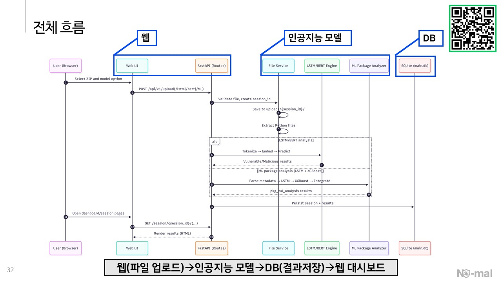

### 🤖 AI 분석 파이프라인

<br>
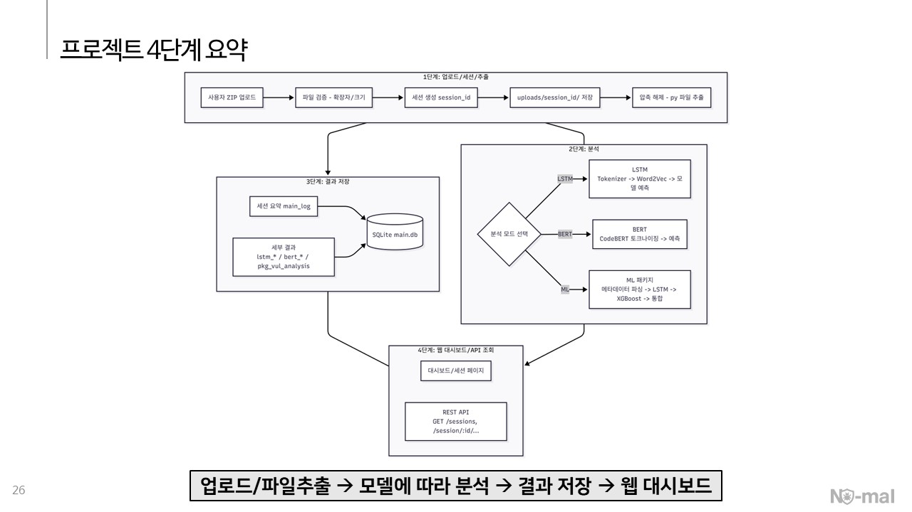

### 📂 디렉토리 구조

```
📦 PySecure 프로젝트
├── 🔥 📂server 🗂 FastAPI 웹 서버 (핵심)
│   ├── 📁 app/                    # FastAPI 애플리케이션
│   ├── 📁 analysis/               # AI 분석 엔진
│   ├── 📁 database/               # 데이터베이스 관리
│   ├── 📁 models/                 # AI 모델 파일
│   └── 📄 run.py                  # 서버 실행 스크립트
├── 🔥 📂vscode-Python Security Analyzer 🗂 VS Code 확장 (핵심)
│   ├── 📁 src/                    # 확장 프로그램 소스코드
│   ├── 📄 package.json            # 확장 프로그램 설정
│   └── 📄 python-security-analyzer-0.1.0.vsix  # 배포용 패키지
├── 🛠️ 📂safepy_3 🗂 LSTM 취약점 분석 모델 (개발 기능)
├── 🛠️ 📂safepy_3_malicious 🗂 LSTM 악성코드 분석 모델 (개발 기능)
├── 🛠️ 📂safepy_3_malicious_ML 🗂 ML 통합 분석 모델 (개발 기능)
├── 🛠️ 📂codebert_mal 🗂 BERT 악성코드 분석 모델 (개발 기능)
├── 🛠️ 📂codebert_test2 🗂 BERT 취약점 분석 모델 (개발 기능)
├── 🛠️ 📂colab_files 🗂 Jupyter 노트북 개발 파일 (개발 기능)
├── 🛠️ 📂dataset 🗂 학습 데이터셋 (개발 기능)
├── 📚 📂데모파일 🗂 데모용 샘플 파일
├── 📚 📂교육자료 🗂 프로젝트 교육 자료
├── 📚 📂발표자료 🗂 발표용 자료
└── 📕README.md
```

#### 🔥 핵심 구성요소
- **server**: PySecure의 메인 웹 서버로, FastAPI 기반의 분석 엔진과 웹 인터페이스를 제공
- **vscode-Python Security Analyzer**: VS Code에서 직접 사용할 수 있는 확장 프로그램

#### 🛠️ 개발 기능들
- **safepy_3 시리즈**: LSTM 기반 취약점 및 악성코드 분석 모델들
- **codebert 시리즈**: BERT 기반 고도화된 코드 분석 모델들
- **colab_files**: 모델 개발 및 실험용 Jupyter 노트북들
- **dataset**: AI 모델 학습에 사용된 데이터셋

#### 📚 참고 자료
- **데모파일**: 시스템 테스트용 샘플 파일들
- **교육자료**: 프로젝트 개발 과정 문서들
- **발표자료**: 프로젝트 소개 및 발표 자료들

## 8. 사용법

### 웹 서버 실행

#### 1. 의존성 설치

```bash
cd server
pip install -r requirements.txt
```

#### 2. 서버 실행

```bash
python run.py
```

#### 3. 웹 접속

```
http://127.0.0.1:8000
```

### VS Code 확장 사용

#### 1. 확장 프로그램 설치

```bash
cd vscode-Python Security Analyzer
# .vsix 파일을 VS Code에서 설치
```

#### 2. 사용 방법

1. VS Code에서 명령 팔레트 열기 (Ctrl+Shift+P)
2. "Python Security Analyzer" 검색
3. 분석할 폴더 선택
4. 분석 결과 확인

### API 사용

#### 파일 업로드 및 분석

```bash
# LSTM 통합 분석
curl -X POST "http://127.0.0.1:8000/api/v1/upload/lstm" \
     -F "file=@your_package.zip"

# BERT 악성코드 분석
curl -X POST "http://127.0.0.1:8000/api/v1/upload/bert/mal" \
     -F "file=@your_package.zip"

# ML 통합 분석
curl -X POST "http://127.0.0.1:8000/api/v1/upload/ML" \
     -F "file=@your_package.zip"
```

#### 분석 결과 조회

```bash
# 세션 목록
curl "http://127.0.0.1:8000/api/v1/sessions"

# 세션 상세 정보
curl "http://127.0.0.1:8000/api/v1/sessions/{session_id}"

# 분석 통계
curl "http://127.0.0.1:8000/api/v1/stats"
```

<br>

## 9. 주요 기능 상세

### AI 분석 엔진

#### LSTM 기반 분석
- **취약점 탐지**: SQL Injection, XSS, 경로 조작 등 CWE 기반 취약점 분석
- **악성코드 탐지**: 악성 패키지, 백도어, 타이포스쿼팅 탐지
- **Word2Vec 임베딩**: 코드 토큰을 벡터로 변환하여 패턴 학습

|취약점 분석|악성코드 탐지|위험도 평가|
|------|---|---|
|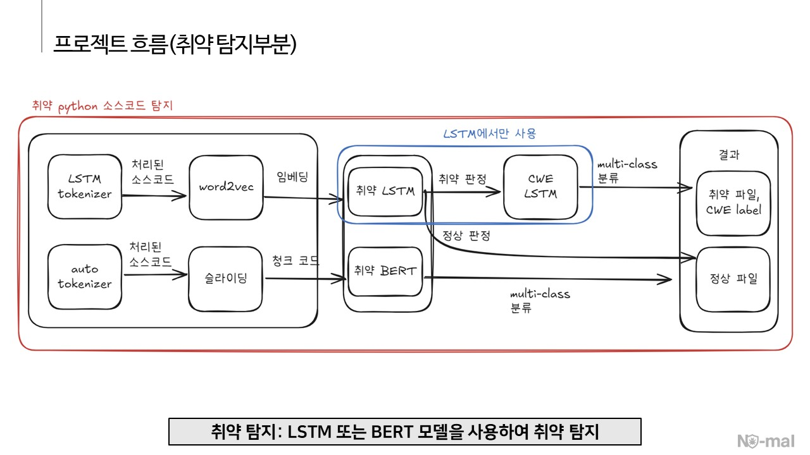||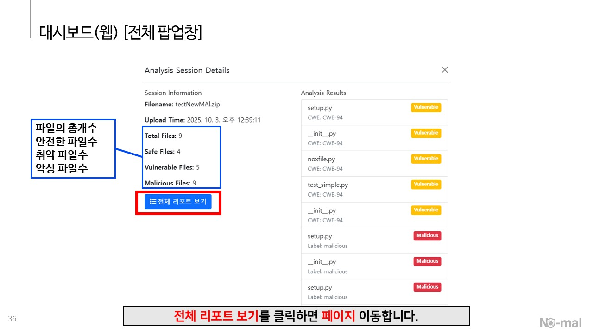|

#### BERT 기반 분석
- **CodeBERT 모델**: 코드 이해에 특화된 BERT 모델 활용
- **고도화된 분석**: 문맥을 고려한 정밀한 보안 위협 탐지
- **다중 라벨 분류**: 여러 취약점 유형을 동시에 탐지

#### ML 통합 분석
- **메타데이터 분석**: 패키지 정보, 다운로드 수, 작성자 신뢰도
- **XGBoost 예측**: 악성 패키지 확률 예측
- **통합 위험도**: 다중 모델 결과를 종합한 최종 평가

### 웹 인터페이스

#### 대시보드
- **실시간 통계**: 전체 분석 통계 및 트렌드
- **세션 관리**: 최근 분석 세션 목록 및 상태
- **모델 선택**: LSTM, BERT, ML 모델 선택 가능

#### 분석 결과 뷰
- **취약점 분석**: CWE 기반 취약점 상세 정보
- **악성코드 분석**: 악성 패턴 및 위험도 표시
- **소스코드 뷰어**: 문제가 있는 코드 라인 하이라이트

### VS Code 확장

#### 커맨드 분석
- **폴더 압축**: 현재 작업 폴더를 ZIP으로 자동 압축
- **서버 업로드**: FastAPI 서버로 자동 업로드
- **결과 표시**: VS Code 내에서 분석 결과 확인

#### 개발자 경험
- **워크플로우 통합**: 기존 개발 과정에 자연스럽게 통합
- **실시간 피드백**: 코드 작성 중 보안 위협 즉시 확인
- **상세 리포트**: 문제점과 해결 방안 제시

## 10. 성능 및 특징

### 성능 최적화
- **병렬 처리**: 3개 워커 프로세스로 동시 분석
- **메모리 효율**: 스트리밍 방식으로 대용량 파일 처리
- **지연 로딩**: 필요한 모델만 메모리에 로드
- **캐싱**: 분석 결과 캐싱으로 중복 분석 방지

### 확장성
- **모듈화 구조**: 새로운 AI 모델 쉽게 추가
- **플러그인 아키텍처**: 분석 엔진 독립적 개발
- **API 기반**: 외부 시스템과의 연동 지원
- **마이크로서비스**: 각 분석 엔진 독립적 배포 가능

|모듈화 구조|API 연동|데이터 관리|
|------|---|---|
|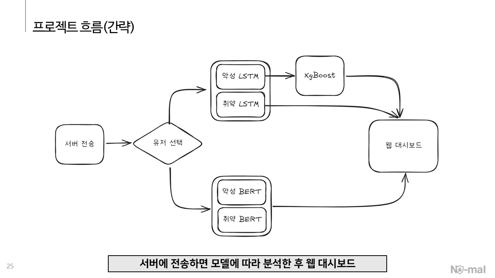||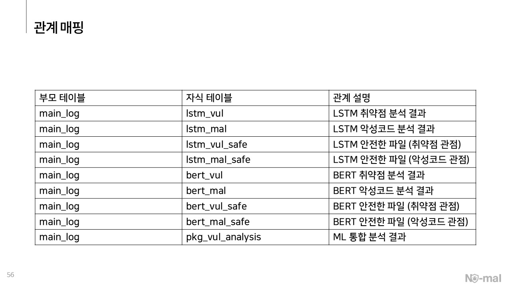|

**API 연동**: RESTful API를 통한 외부 시스템 연동, FastAPI 기반 자동 문서화, WebSocket을 통한 실시간 분석 진행 상황 전송

### 보안
- **파일 검증**: 업로드 파일의 확장자 및 크기 제한
- **격리 실행**: 분석 프로세스 격리로 시스템 보안
- **임시 파일 정리**: 분석 완료 후 임시 파일 자동 삭제
- **세션 관리**: 고유 세션 ID로 사용자 데이터 분리

## 11. 기타

### 데모 파일
- `데모파일/python-packages-1757531529324.zip`: 샘플 Python 패키지
- `데모파일/testNewMAl.zip`: 악성코드 테스트 파일

### 교육 자료
- `교육자료/20250710_초기_프로젝트_자료조사.pdf`: 초기 프로젝트 조사 자료
- `교육자료/20250713_초기_프로젝트_Github.pdf`: GitHub 활용 가이드
- `교육자료/20250729_KISIA_해커톤_전략.pdf`: KISIA 해커톤 전략

### 발표 자료
- `발표자료/PT-SecurePy.pdf`: 프로젝트 발표 자료

### 사용 동영상
- [사용 동영상 가이드](https://youtu.be/-y6QJE9Cj4s)

### Metrics

- **정확도**: LSTM 95%+, BERT 97%+, ML 통합 98%+
- **처리 속도**: 평균 10MB 패키지 30초 내 분석 완료
- **지원 언어**: Python 3.12.10 (Release Date: April 8, 2025 기준 테스트 완료)
- **지원 플랫폼**: Windows, macOS, Linux

## 12. 기여하기

1. Fork the Project
2. Create your Feature Branch (`git checkout -b feature/AmazingFeature`)
3. Commit your Changes (`git commit -m 'Add some AmazingFeature'`)
4. Push to the Branch (`git push origin feature/AmazingFeature`)
5. Open a Pull Request

## 13. 연락처

프로젝트 관련 문의사항이 있으시면 이슈를 생성해 주세요.

---

<div align="center">
    <p>Made with ❤️ by PySecure Team</p>
</div>