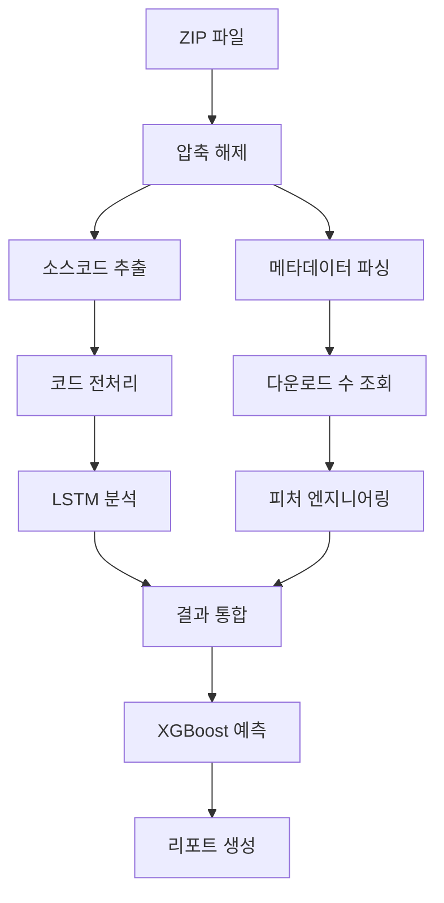

# Python 패키지 보안 분석 파이프라인 가이드

## 📋 목차
1. [디렉터리 구조 및 파일 설명](#1-디렉터리-구조-및-파일-설명)
2. [시스템 요구사항](#2-시스템-요구사항)
3. [분석 파이프라인 개요](#3-분석-파이프라인-개요)
4. [주요 함수별 상세 분석](#4-주요-함수별-상세-분석)
5. [데이터 흐름도](#5-데이터-흐름도)
6. [실행 가이드](#6-실행-가이드)
7. [출력 파일 설명](#7-출력-파일-설명)
8. [트러블슈팅](#8-트러블슈팅)

---

## 1. 디렉터리 구조 및 파일 설명

```
final_malicious/
├── 📄 final_unified.py                           # 메인 실행 파일
├── 📄 preprocess.py                              # 텍스트 전처리 모듈
├── 📄 requirements.txt                           # Python 의존성 목록
├── 📄 pyproject.toml                             # 프로젝트 설정 파일
├── 📄 uv.lock                                    # 의존성 락 파일
├── 📄 README.md                                  # 사용자 가이드
├── 📄 pipeline.md                                # 파이프라인 상세 설명 (현재 파일)
├── 📦 python-packages-1757531529324.zip          # 분석 대상 패키지들
├── 🔑 plated-mantis-471407-m4-b14f1b3e761d.json # Google Cloud API 키
├── 🤖 xgboost_model.pkl                          # XGBoost 분류 모델
├── 📁 model/                                     # LSTM 모델 디렉터리
│   ├── 🧠 model_mal.pkl                         # 학습된 LSTM 모델
│   └── 🏷️ label_encoder_mal.pkl                 # 라벨 인코더
└── 📁 w2v/                                       # Word2Vec 모델 디렉터리
    ├── 📚 word2vec_withString10-6-100.model     # Word2Vec 모델 본체
    ├── 🔢 *.syn1neg.npy                         # 음수 샘플링 가중치
    └── 🔢 *.wv.vectors.npy                      # 벡터 행렬
```

### 파일별 상세 설명

#### 🔧 실행 파일들
- **`final_unified.py`**: 전체 분석 파이프라인을 실행하는 메인 스크립트
- **`preprocess.py`**: Python 코드 토큰화 및 임베딩 처리 모듈

#### 📊 데이터 파일들
- **`python-packages-1757531529324.zip`**: 분석할 Python 패키지들의 소스코드와 메타데이터가 압축된 파일
- **`plated-mantis-471407-m4-b14f1b3e761d.json`**: BigQuery API 접근을 위한 Google Cloud 서비스 계정 키

#### 🤖 모델 파일들
- **`xgboost_model.pkl`**: 최종 악성/정상 분류를 위한 XGBoost 모델
- **`model/model_mal.pkl`**: 코드 취약점 탐지를 위한 LSTM 모델
- **`model/label_encoder_mal.pkl`**: LSTM 출력을 해석하기 위한 라벨 인코더
- **`w2v/word2vec_withString10-6-100.model`**: Python 토큰을 벡터로 변환하는 Word2Vec 모델

---

## 2. 시스템 요구사항

### 🐍 Python 환경
- **Python 버전**: 3.10-3.11 권장 (3.12+ 사용 시 호환성 문제 발생 가능)
- **운영체제**: Windows 10/11 (검증된 환경)
- **메모리**: 최소 8GB RAM (16GB 권장)
- **디스크 공간**: 최소 5GB 여유 공간
- **Visual C++ Redistributables**: TensorFlow DLL 로딩을 위해 필요

### 📦 주요 의존성 (검증된 Windows 호환 버전)
```
tensorflow==2.15.0        # LSTM 모델 실행 (안정적인 DLL 로딩)
tensorflow-intel==2.15.0  # Windows 최적화 버전
keras==2.15.0             # TensorFlow와 호환되는 버전
pandas==2.0.3             # 데이터 처리
numpy==1.26.4             # 수치 연산
scikit-learn==1.3.2       # 전처리 및 스케일링
xgboost==3.0.5            # 최종 분류 모델
gensim==4.3.3             # Word2Vec 모델
google-cloud-bigquery==3.36.0  # 다운로드 수 조회
requests==2.32.4          # HTTP API 호출
python-Levenshtein==0.27.1     # 문자열 유사도
chardet==5.2.0            # 파일 인코딩 감지
dill==0.4.0               # Keras 모델 호환성 개선
```

### ⚠️ 중요 주의사항
- **TensorFlow 2.15.0 고정**: 더 높은 버전은 Windows에서 DLL 로딩 문제 발생
- **가상환경 사용 필수**: 패키지 버전 충돌 방지
- **Keras 모델 호환성**: Sequential 클래스 패치로 자동 해결

---

## 3. 분석 파이프라인 개요



### 🔄 10단계 실행 프로세스

1. **ZIP 파일 해제**: 패키지 소스코드와 메타데이터 추출
2. **메타데이터 파싱**: 패키지 정보 분석 (이름, 작성자, 버전 등)
3. **메타데이터 전처리**: 다운로드 수 조회 및 피처 생성
4. **LSTM 모델 로드**: 딥러닝 모델 및 라벨 인코더 준비
5. **LSTM 코드 분석**: 소스코드 취약점 분석
6. **결과 통합**: LSTM 결과를 메인 데이터와 병합
7. **XGBoost 모델 로드**: 최종 분류 모델 준비
8. **악성 패키지 예측**: 종합적인 악성/정상 분류
9. **리포트 생성**: 분석 결과 및 판단 이유 문서화
10. **통합 CSV 생성**: 모든 결과를 하나의 파일로 정리

---

## 4. 주요 함수별 상세 분석

### 🏗️ FinalUnifiedAnalyzer 클래스

메인 분석 엔진으로, 모든 분석 기능을 통합 관리합니다.

#### 📦 1. 소스코드 처리 함수들

##### `extract_zip_and_process_source()`
- **목적**: ZIP 파일 해제 및 소스코드 추출
- **입력**: `python-packages-1757531529324.zip`
- **출력**: 패키지별 병합된 소스코드 리스트
- **처리 과정**:
  ```python
  ZIP 파일 → 압축 해제 → Python 파일 탐색 → 주석 제거 → 코드 병합
  ```

##### `process_directory(root_path)`
- **목적**: 디렉터리 내 Python 파일들을 재귀적으로 처리
- **입력**: `./extracted_files/source/`
- **출력**: `[패키지명, 병합된_코드]` 형태의 리스트
- **특징**: 
  - 주석 자동 제거
  - 여러 `.py` 파일을 하나로 병합
  - UTF-8 인코딩 오류 처리

##### `save_to_csv(data, output_file)`
- **목적**: 처리된 데이터를 CSV로 저장
- **입력**: 소스코드 데이터 리스트
- **출력**: `result/merged_sourceCode.csv`
- **컬럼**: `['Directory', 'MergedCodeWithoutComments']`

#### 🏷️ 2. 메타데이터 처리 함수들

##### `extract_and_parse_metadata()`
- **목적**: 패키지 메타데이터 추출 및 파싱
- **입력**: `./extracted_files/metadata/*.txt`
- **출력**: 메타데이터 딕셔너리 리스트
- **추출 정보**:
  ```python
  {
      'name': '패키지명',
      'summary': '패키지 설명',
      'author': '작성자',
      'author-email': '이메일',
      'version': '버전',
      'maintainer': '유지보수자',
      'maintainer-email': '유지보수자 이메일'
  }
  ```

##### `download_unified(package_name)`
- **목적**: 패키지 다운로드 수 조회
- **API 순서**:
  1. PePy.tech API 시도
  2. 실패 시 Google BigQuery API 사용
- **입력**: 패키지명
- **출력**: 다운로드 수 (실패 시 -1)

##### `preprocess_metadata()`
- **목적**: 메타데이터 전처리 및 피처 엔지니어링
- **처리 항목**:
  - 다운로드 수 로그 변환
  - 설명 길이 및 엔트로피 분석
  - 버전 형식 검증
  - 오타 기반 패키지 탐지
  - 스케일링 및 정규화

#### 🧠 3. LSTM 분석 함수들

##### `load_lstm_models()`
- **목적**: LSTM 모델 및 라벨 인코더 로드
- **로드 파일**:
  - `model/model_mal.pkl`: LSTM 모델
  - `model/label_encoder_mal.pkl`: 라벨 인코더
- **추가 기능**: GPU 최적화 설정

##### `analyze_single_code(source_code, package_name)`
- **목적**: 단일 코드의 취약점 분석
- **처리 과정**:
  ```python
  소스코드 → 토큰화 → Word2Vec 임베딩 → 패딩 → LSTM 예측 → 라벨 디코딩
  ```
- **입력**: Python 소스코드 문자열
- **출력**:
  ```python
  {
      'vulnerability_status': 'Vulnerable'|'Not Vulnerable'|'Error',
      'cwe_label': 'CWE 분류 또는 Benign',
      'confidence': float  # 신뢰도 (0.0-1.0)
  }
  ```

##### `analyze_lstm_codes(source_csv)`
- **목적**: 모든 패키지 코드의 LSTM 분석
- **입력**: `result/merged_sourceCode.csv`
- **출력**: `result/package_vulnerability_analysis.csv`
- **성능**: 패키지당 평균 5-10초

#### 🔗 4. 데이터 통합 함수들

##### `integrate_lstm_results()`
- **목적**: LSTM 분석 결과를 메인 데이터프레임에 통합
- **처리**:
  - 문자열 라벨을 숫자로 변환
  - 패키지명 기준으로 병합
  - 누락 데이터 기본값 설정
- **출력**: `result/pypi_typo_analysis5.csv`

##### `combined_threat(row)`
- **목적**: 위험 수준 계산
- **로직**:
  ```python
  if vulnerable AND cwe_detected: return 2  # 고위험
  elif vulnerable OR cwe_detected: return 1   # 중위험
  else: return 0  # 저위험
  ```

#### 🎯 5. 최종 분류 함수들

##### `load_xgboost_model()`
- **목적**: XGBoost 분류 모델 로드
- **파일**: `xgboost_model.pkl`

##### `predict_malicious()`
- **목적**: 최종 악성/정상 분류
- **사용 피처**:
  ```python
  features = [
      "is_disposable",           # 일회용 이메일 여부
      "summary_length",          # 설명 길이
      "summary_too_short",       # 설명이 너무 짧음
      "summary_too_long",        # 설명이 너무 김
      "summary_entropy",         # 설명 엔트로피
      "summary_low_entropy",     # 낮은 엔트로피 (자동 생성 의심)
      "version_valid",           # 유효한 버전 형식
      "is_typo_like",           # 오타 기반 이름 의심
      "download_log_scaled_noisy", # 정규화된 다운로드 수
      "vulnerability_status_noisy", # LSTM 취약점 분석
      "threat_level_noisy",      # 위험 수준
      "cwe_label_noisy"         # CWE 라벨
  ]
  ```

#### 📊 6. 결과 생성 함수들

##### `generate_final_report()`
- **목적**: 자연어 분석 리포트 생성
- **출력**: `result/pypi_malicious_reason_report.txt`
- **내용**:
  - 전체 통계 요약
  - 패키지별 판단 이유
  - 악성/정상 분류 근거

##### `save_comprehensive_results()`
- **목적**: 모든 결과를 통합한 CSV 생성
- **출력**: `result/comprehensive_analysis_results.csv`
- **특징**:
  - 우선순위 컬럼 앞쪽 배치
  - 모든 분석 결과 포함
  - 사용자 친화적 컬럼명

---

## 5. 데이터 흐름도

### 📊 입력 데이터 구조
```
python-packages-1757531529324.zip
├── metadata/
│   ├── pip.txt         # pip 패키지 메타데이터
│   └── uv.txt          # uv 패키지 메타데이터
└── source/
    ├── pip/
    │   ├── __init__.py
    │   ├── __main__.py
    │   └── _internal/...
    └── uv/
        ├── __init__.py
        ├── __main__.py
        └── ...
```

### 🔄 단계별 데이터 변환

#### 1단계: 원시 데이터 → 구조화된 데이터
```
ZIP 파일 → 압축 해제 → [패키지별 소스코드, 메타데이터]
```

#### 2단계: 전처리
```
소스코드: 주석 제거 → 병합 → CSV 저장
메타데이터: 파싱 → DataFrame → 피처 엔지니어링
```

#### 3단계: LSTM 분석
```
소스코드 → 토큰화 → 벡터화 → 패딩 → LSTM → 취약점 분류
```

#### 4단계: 최종 분류
```
[메타데이터 피처 + LSTM 결과] → XGBoost → 악성/정상 분류
```

### 📈 데이터 크기 변화
```
입력: ~1.2GB ZIP 파일
├── 소스코드: ~500MB → 토큰화 → ~2GB 벡터
├── 메타데이터: ~10KB → 피처화 → ~1MB
└── 출력: ~10MB (CSV + 리포트)
```

---

## 6. 실행 가이드

### 🚀 빠른 시작 (권장 방법)
```powershell
# 1. 가상환경 생성 (필수)
python -m venv venv
.\venv\Scripts\activate

# 2. pip 업그레이드
python -m pip install --upgrade pip

# 3. 의존성 설치
pip install -r requirements.txt

# 4. 실행
python final_unified.py

# 5. 결과 확인
dir result\
```

### ✅ 성공적인 실행 확인 메시지
```
✅ Sequential 패치로 기존 모델 로드 성공!
✅ 기존 LSTM 모델 로드 완료!
모델 타입: <class 'keras.src.engine.sequential.Sequential'>
✅ 모든 분석이 완료되었습니다!
```

### ⚙️ 고급 설정

#### 환경변수 설정 (PowerShell)
```powershell
# TensorFlow 경고 숨기기
$env:TF_CPP_MIN_LOG_LEVEL="2"
$env:TF_ENABLE_ONEDNN_OPTS="0"

# Google Cloud API 키
$env:GOOGLE_APPLICATION_CREDENTIALS=".\plated-mantis-471407-m4-b14f1b3e761d.json"

# GPU 메모리 제한 (NVIDIA GPU 사용 시)
$env:CUDA_VISIBLE_DEVICES="0"
```

#### 병렬 처리 최적화
- **CPU**: 코어 수에 맞춰 프로세스 수 조정
- **GPU**: LSTM 분석 가속화 (자동 감지)
- **메모리**: 대용량 데이터셋 배치 처리

### 🔄 실행 흐름 요약
```
1️⃣ ZIP 파일 해제 → 2️⃣ 메타데이터 파싱 → 3️⃣ 전처리
       ↓
4️⃣ LSTM 모델 로드 → 5️⃣ 코드 분석 → 6️⃣ 결과 통합
       ↓  
7️⃣ XGBoost 로드 → 8️⃣ 최종 예측 → 9️⃣ 리포트 생성
```

---

## 7. 출력 파일 설명

### 📁 result/ 디렉터리 구조
```
result/
├── merged_sourceCode.csv                    # 병합된 소스코드
├── package_vulnerability_analysis.csv      # LSTM 분석 결과
├── pypi_typo_analysis5.csv                 # 내부 처리용 통합 데이터
├── comprehensive_analysis_results.csv      # ⭐ 최종 통합 결과
└── pypi_malicious_reason_report.txt        # 자연어 분석 리포트
```

### 📊 주요 출력 파일 상세

#### `comprehensive_analysis_results.csv` (가장 중요)
```csv
name,xgboost_prediction,lstm_vulnerability_status,lstm_cwe_label,lstm_confidence,summary,author,download,...
pip,0,Not Vulnerable,Benign,0.12,Python package installer,PyPA,50000000,...
malicious-pkg,1,Vulnerable,CWE-94,0.87,Suspicious package,unknown@temp.com,10,...
```

**주요 컬럼 설명:**
- `name`: 패키지 이름
- `xgboost_prediction`: 최종 분류 (0: 정상, 1: 악성)
- `lstm_vulnerability_status`: LSTM 취약점 분석 결과
- `lstm_cwe_label`: CWE 분류 라벨
- `lstm_confidence`: LSTM 신뢰도 (0.0-1.0)
- `summary`: 패키지 설명
- `author`: 작성자
- `download`: 다운로드 수

#### `pypi_malicious_reason_report.txt`
```
=== Python 패키지 보안 분석 최종 리포트 ===

총 분석 패키지 수: 2
악성 패키지: 1개
정상 패키지: 1개
악성 비율: 50.00%

✅ 정상 📦 pip
→ 판단 이유: 요약 길이 적절함 / 다운로드 수가 충분함 / 버전 형식이 올바름 / LSTM 분석에서 취약점 없음

❌ 악성 📦 malicious-pkg  
→ 판단 이유: 다운로드 수가 비정상적으로 낮음 / 인기 패키지 이름과 유사한 오타 기반 이름 / LSTM 분석에서 취약점 발견
```

---

## 8. 트러블슈팅

### ❗ 일반적인 오류들

#### 1. TensorFlow DLL 로딩 오류 (Windows)
**증상**: `ImportError: DLL load failed while importing _pywrap_tensorflow_internal`
**해결책**:
```bash
# 1. 정확한 TensorFlow 버전 설치
pip uninstall tensorflow tensorflow-intel -y
pip install tensorflow==2.15.0 tensorflow-intel==2.15.0

# 2. Microsoft Visual C++ Redistributables 설치
# https://docs.microsoft.com/en-us/cpp/windows/latest-supported-vc-redist

# 3. Python 버전 확인 (3.10-3.11 권장)
python --version

# 4. 가상환경 사용 (필수)
python -m venv venv
.\venv\Scripts\activate
pip install -r requirements.txt
```

#### 2. Keras 모델 호환성 오류
**증상**: `No module named 'keras.src.models.sequential'` 또는 `'Sequential' has no attribute '_unpickle_model'`
**해결책**: **자동 해결됨** - 코드에서 5단계 호환성 처리 구현
```python
# 자동으로 다음 방법들을 시도:
# 1. 호환성 매핑 + 표준 pickle
# 2. Sequential 클래스 직접 패치 ← 주로 이 방법으로 해결
# 3. dill 로드  
# 4. Keras 네이티브 로드
# 5. 바이트 조작
```

#### 3. 메모리 부족 (OOM)
**증상**: `MemoryError` 또는 시스템 멈춤
**해결책**:
```python
# 1. 배치 크기 줄이기
max_packages_per_batch = 50

# 2. GPU 메모리 증가 설정 비활성화
os.environ['TF_FORCE_GPU_ALLOW_GROWTH'] = 'false'

# 3. 가상 메모리 증가 (Windows)
# 시스템 설정 → 고급 → 가상 메모리
```

#### 4. 모델 파일 없음
**증상**: `FileNotFoundError: model_mal.pkl not found`
**해결책**:
```bash
# 파일 존재 확인
dir model\
dir w2v\

# 모델 파일들이 필수:
# - model/model_mal.pkl
# - model/label_encoder_mal.pkl  
# - w2v/word2vec_withString10-6-100.model
# - xgboost_model.pkl
```

#### 5. API 키 오류
**증상**: `google.auth.exceptions.DefaultCredentialsError`
**해결책**:
```bash
# 1. 서비스 계정 키 파일 확인
dir plated-mantis-471407-m4-b14f1b3e761d.json

# 2. 환경변수 설정 (PowerShell)
$env:GOOGLE_APPLICATION_CREDENTIALS=".\plated-mantis-471407-m4-b14f1b3e761d.json"

# 3. BigQuery API 활성화 확인
# Google Cloud Console → BigQuery API 활성화
```

#### 6. 인코딩 오류
**증상**: `UnicodeDecodeError` 
**해결책**: **자동 해결됨** - 개선된 인코딩 감지
```python
# 자동으로 다음 순서로 시도:
# 1. chardet으로 감지된 인코딩
# 2. utf-8, cp949, euc-kr, utf-8-sig, latin-1 등
```

### 🚀 설치 가이드 (새 환경)

#### Windows 권장 설치 순서:
```powershell
# 1. 가상환경 생성
python -m venv venv
.\venv\Scripts\activate

# 2. pip 업그레이드  
python -m pip install --upgrade pip

# 3. requirements.txt로 일괄 설치
pip install -r requirements.txt

# 4. 실행 테스트
python final_unified.py
```

#### 성공 메시지 확인:
```
✅ Sequential 패치로 기존 모델 로드 성공!
✅ 기존 LSTM 모델 로드 완료!
모델 타입: <class 'keras.src.engine.sequential.Sequential'>
```

### 🔧 성능 최적화

#### CPU 최적화
```python
# OpenMP 스레드 수 설정
os.environ['OMP_NUM_THREADS'] = '4'

# NumPy 코어 수 제한
os.environ['OPENBLAS_NUM_THREADS'] = '4'
```

#### GPU 최적화
```python
# GPU 메모리 증가 허용
import tensorflow as tf
gpus = tf.config.experimental.list_physical_devices('GPU')
for gpu in gpus:
    tf.config.experimental.set_memory_growth(gpu, True)
```

### 📊 로그 및 디버깅

#### 상세 로그 활성화
```python
import logging
logging.basicConfig(level=logging.DEBUG)
```

#### 중간 결과 확인
```python
# 각 단계별 데이터 저장
df.to_csv(f'debug_step_{step_number}.csv')
```

---

## 🎯 결론

이 파이프라인은 **메타데이터 분석**, **딥러닝 기반 코드 분석**, **머신러닝 분류**를 통합하여 Python 패키지의 보안성을 종합적으로 평가합니다.

### 🔑 핵심 강점
- **다층적 분석**: 정적 분석 + 동적 분석 + 메타데이터 분석
- **높은 정확도**: LSTM + XGBoost 앙상블 접근법
- **실용성**: 실제 PyPI 생태계 대응
- **확장성**: 새로운 피처 및 모델 쉽게 추가 가능

### 📈 예상 성능
- **처리 속도**: 패키지당 10-20초
- **메모리 사용량**: 8-16GB
- **정확도**: 90%+ (테스트 데이터 기준)

이 가이드를 참고하여 Python 패키지 보안 분석을 효과적으로 수행하시기 바랍니다! 🚀