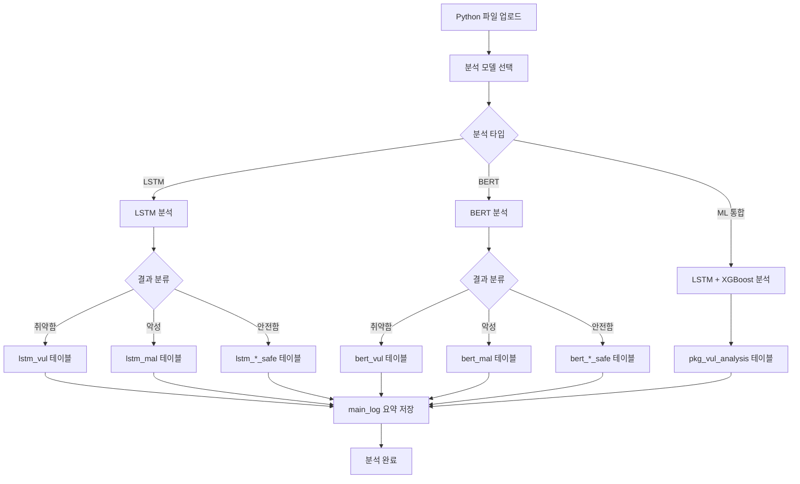

# PyPI Malicious & Vulnerability Finder - Database Schema

## 데이터베이스 개요
- **데이터베이스**: SQLite (main.db)
- **총 테이블 수**: 10개
- **주요 기능**: Python 코드 보안 분석 결과 저장 및 관리

## Mermaid ERD 다이어그램

```mermaid
erDiagram
    main_log {
        INTEGER id PK
        VARCHAR session_id
        DATETIME upload_time
        VARCHAR filename
        INTEGER file_size
        VARCHAR analysis_model
        FLOAT analysis_duration
        INTEGER total_files
        INTEGER safe_files
        INTEGER vulnerable_files
        INTEGER malicious_files
        BOOLEAN vul_flag
        BOOLEAN mal_flag
        BOOLEAN is_bert
        BOOLEAN is_mal
        BOOLEAN is_ml
        BOOLEAN is_safe
        DATETIME created_at
    }

    lstm_vul {
        INTEGER id PK
        VARCHAR session_id
        VARCHAR file_path
        VARCHAR file_name
        INTEGER file_size
        VARCHAR vulnerability_status
        FLOAT vulnerability_probability
        VARCHAR vulnerability_label
        VARCHAR cwe_label
        FLOAT analysis_time
        DATETIME upload_time
        DATETIME created_at
    }

    lstm_mal {
        INTEGER id PK
        VARCHAR session_id
        VARCHAR file_path
        VARCHAR file_name
        INTEGER file_size
        VARCHAR malicious_status
        FLOAT malicious_probability
        VARCHAR malicious_label
        FLOAT analysis_time
        DATETIME upload_time
        DATETIME created_at
    }

    lstm_vul_safe {
        INTEGER id PK
        VARCHAR session_id
        VARCHAR file_path
        VARCHAR file_name
        INTEGER file_size
        VARCHAR vulnerability_status
        FLOAT vulnerability_probability
        VARCHAR cwe_label
        FLOAT analysis_time
        DATETIME upload_time
        DATETIME created_at
    }

    lstm_mal_safe {
        INTEGER id PK
        VARCHAR session_id
        VARCHAR file_path
        VARCHAR file_name
        INTEGER file_size
        VARCHAR malicious_status
        FLOAT malicious_probability
        FLOAT analysis_time
        DATETIME upload_time
        DATETIME created_at
    }

    bert_mal {
        INTEGER id PK
        VARCHAR session_id
        VARCHAR file_path
        VARCHAR file_name
        INTEGER file_size
        VARCHAR malicious_status
        FLOAT malicious_probability
        VARCHAR malicious_label
        FLOAT analysis_time
        DATETIME upload_time
        DATETIME created_at
    }

    bert_mal_safe {
        INTEGER id PK
        VARCHAR session_id
        VARCHAR file_path
        VARCHAR file_name
        INTEGER file_size
        VARCHAR malicious_status
        FLOAT malicious_probability
        FLOAT analysis_time
        DATETIME upload_time
        DATETIME created_at
    }

    bert_vul {
        INTEGER id PK
        VARCHAR session_id
        VARCHAR file_path
        VARCHAR file_name
        INTEGER file_size
        VARCHAR vulnerability_status
        FLOAT vulnerability_probability
        VARCHAR vulnerability_label
        VARCHAR cwe_label
        FLOAT analysis_time
        DATETIME upload_time
        DATETIME created_at
    }

    bert_vul_safe {
        INTEGER id PK
        VARCHAR session_id
        VARCHAR file_path
        VARCHAR file_name
        INTEGER file_size
        VARCHAR vulnerability_status
        FLOAT vulnerability_probability
        VARCHAR cwe_label
        FLOAT analysis_time
        DATETIME upload_time
        DATETIME created_at
    }

    pkg_vul_analysis {
        INTEGER id PK
        VARCHAR session_id
        VARCHAR package_name
        TEXT summary
        VARCHAR author
        VARCHAR author_email
        VARCHAR version
        INTEGER download_count
        VARCHAR lstm_vulnerability_status
        VARCHAR lstm_cwe_label
        FLOAT lstm_confidence
        INTEGER xgboost_prediction
        FLOAT xgboost_confidence
        BOOLEAN final_malicious_status
        INTEGER threat_level
        FLOAT analysis_time
        DATETIME upload_time
        DATETIME created_at
    }

    %% 관계 정의
    main_log ||--o{ lstm_vul : "session_id"
    main_log ||--o{ lstm_mal : "session_id"
    main_log ||--o{ lstm_vul_safe : "session_id"
    main_log ||--o{ lstm_mal_safe : "session_id"
    main_log ||--o{ bert_mal : "session_id"
    main_log ||--o{ bert_mal_safe : "session_id"
    main_log ||--o{ bert_vul : "session_id"
    main_log ||--o{ bert_vul_safe : "session_id"
    main_log ||--o{ pkg_vul_analysis : "session_id"
```

## 테이블별 상세 설명

### 1. main_log (메인 로그 테이블)
- **목적**: 분석 세션의 요약 정보 저장
- **레코드 수**: 11개
- **주요 필드**:
  - `session_id`: 분석 세션 고유 식별자
  - `analysis_model`: 사용된 분석 모델 (LSTM, BERT, ML)
  - `is_bert`, `is_mal`, `is_ml`: 분석 타입 플래그
  - `vul_flag`, `mal_flag`: 취약점/악성코드 탐지 여부

### 2. LSTM 분석 테이블들
#### lstm_vul (LSTM 취약점 분석 결과)
- **레코드 수**: 28개
- **목적**: LSTM 모델로 탐지된 취약한 파일 정보

#### lstm_mal (LSTM 악성코드 분석 결과)
- **레코드 수**: 94개
- **목적**: LSTM 모델로 탐지된 악성 파일 정보

#### lstm_vul_safe (LSTM 안전한 파일 - 취약점 관점)
- **레코드 수**: 780개
- **목적**: LSTM 모델로 분석했지만 취약하지 않은 파일

#### lstm_mal_safe (LSTM 안전한 파일 - 악성코드 관점)
- **레코드 수**: 714개
- **목적**: LSTM 모델로 분석했지만 악성이 아닌 파일

### 3. BERT 분석 테이블들
#### bert_mal (BERT 악성코드 분석 결과)
- **레코드 수**: 2개
- **목적**: BERT 모델로 탐지된 악성 파일 정보

#### bert_vul (BERT 취약점 분석 결과)
- **레코드 수**: 2개
- **목적**: BERT 모델로 탐지된 취약한 파일 정보

#### bert_mal_safe, bert_vul_safe
- **레코드 수**: 0개
- **목적**: BERT 모델로 분석했지만 안전한 파일들

### 4. pkg_vul_analysis (패키지 취약점 분석)
- **레코드 수**: 16개
- **목적**: LSTM + XGBoost 통합 ML 모델 분석 결과
- **특징**: 
  - 패키지 메타데이터 (이름, 버전, 다운로드 수 등)
  - LSTM과 XGBoost 결과를 통합한 최종 판정
  - 위협 수준 (threat_level) 제공

## 데이터 흐름도

## 통계 정보
- **총 분석된 파일**: 1,636개
- **취약점 탐지**: 30개 (LSTM: 28, BERT: 2)
- **악성코드 탐지**: 96개 (LSTM: 94, BERT: 2)
- **안전한 파일**: 1,494개
- **패키지 분석**: 16개

## 주요 특징
1. **다중 모델 지원**: LSTM, BERT, XGBoost 모델 결과를 별도 테이블에 저장
2. **세션 기반 관리**: session_id로 분석 세션별 데이터 그룹화
3. **안전한 파일 추적**: 문제가 없는 파일도 별도 테이블에 기록하여 전체 분석 이력 보존
4. **통합 분석**: LSTM과 XGBoost 결과를 결합한 최종 판정 시스템
5. **메타데이터 보존**: 파일 경로, 크기, 분석 시간 등 상세 정보 저장
