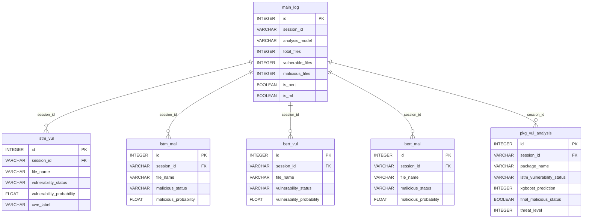
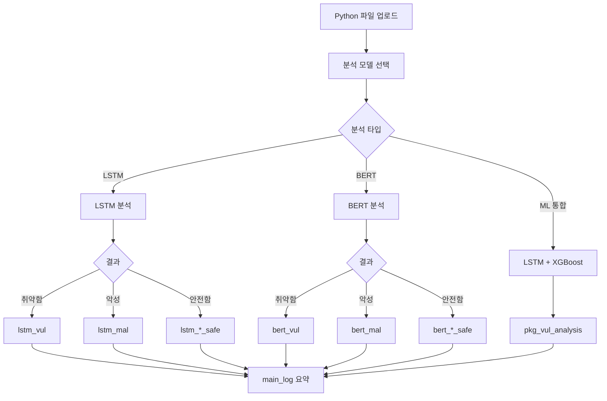
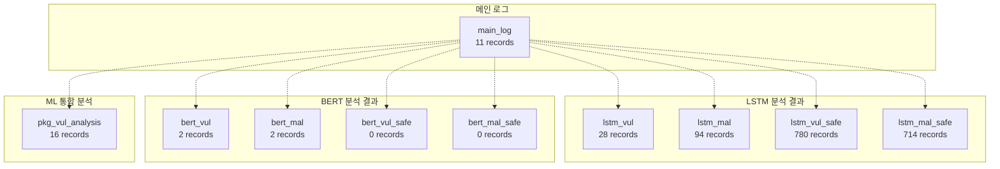

# 데이터베이스 스키마 다이어그램

## ERD (Entity Relationship Diagram)

```mermaid
erDiagram
    main_log {
        INTEGER id PK
        VARCHAR session_id
        VARCHAR analysis_model
        INTEGER total_files
        INTEGER vulnerable_files
        INTEGER malicious_files
        BOOLEAN is_bert
        BOOLEAN is_ml
    }

    lstm_vul {
        INTEGER id PK
        VARCHAR session_id FK
        VARCHAR file_name
        VARCHAR vulnerability_status
        FLOAT vulnerability_probability
        VARCHAR cwe_label
    }

    lstm_mal {
        INTEGER id PK
        VARCHAR session_id FK
        VARCHAR file_name
        VARCHAR malicious_status
        FLOAT malicious_probability
    }

    bert_vul {
        INTEGER id PK
        VARCHAR session_id FK
        VARCHAR file_name
        VARCHAR vulnerability_status
        FLOAT vulnerability_probability
    }

    bert_mal {
        INTEGER id PK
        VARCHAR session_id FK
        VARCHAR file_name
        VARCHAR malicious_status
        FLOAT malicious_probability
    }

    pkg_vul_analysis {
        INTEGER id PK
        VARCHAR session_id FK
        VARCHAR package_name
        VARCHAR lstm_vulnerability_status
        INTEGER xgboost_prediction
        BOOLEAN final_malicious_status
        INTEGER threat_level
    }

    main_log ||--o{ lstm_vul : "session_id"
    main_log ||--o{ lstm_mal : "session_id"
    main_log ||--o{ bert_vul : "session_id"
    main_log ||--o{ bert_mal : "session_id"
    main_log ||--o{ pkg_vul_analysis : "session_id"
```

## 데이터 흐름도

```mermaid
flowchart TD
    A[Python 파일 업로드] --> B[분석 모델 선택]
    B --> C{분석 타입}
    
    C -->|LSTM| D[LSTM 분석]
    C -->|BERT| E[BERT 분석]
    C -->|ML 통합| F[LSTM + XGBoost]
    
    D --> G{결과}
    G -->|취약함| H[lstm_vul]
    G -->|악성| I[lstm_mal]
    G -->|안전함| J[lstm_*_safe]
    
    E --> K{결과}
    K -->|취약함| L[bert_vul]
    K -->|악성| M[bert_mal]
    K -->|안전함| N[bert_*_safe]
    
    F --> O[pkg_vul_analysis]
    
    H --> P[main_log 요약]
    I --> P
    J --> P
    L --> P
    M --> P
    N --> P
    O --> P
```

## 테이블 구조 요약

```mermaid
graph TB
    subgraph "메인 로그"
        ML[main_log<br/>11 records]
    end
    
    subgraph "LSTM 분석 결과"
        LV[lstm_vul<br/>28 records]
        LM[lstm_mal<br/>94 records]
        LVS[lstm_vul_safe<br/>780 records]
        LMS[lstm_mal_safe<br/>714 records]
    end
    
    subgraph "BERT 분석 결과"
        BV[bert_vul<br/>2 records]
        BM[bert_mal<br/>2 records]
        BVS[bert_vul_safe<br/>0 records]
        BMS[bert_mal_safe<br/>0 records]
    end
    
    subgraph "ML 통합 분석"
        PVA[pkg_vul_analysis<br/>16 records]
    end
    
    ML -.-> LV
    ML -.-> LM
    ML -.-> LVS
    ML -.-> LMS
    ML -.-> BV
    ML -.-> BM
    ML -.-> BVS
    ML -.-> BMS
    ML -.-> PVA
```
