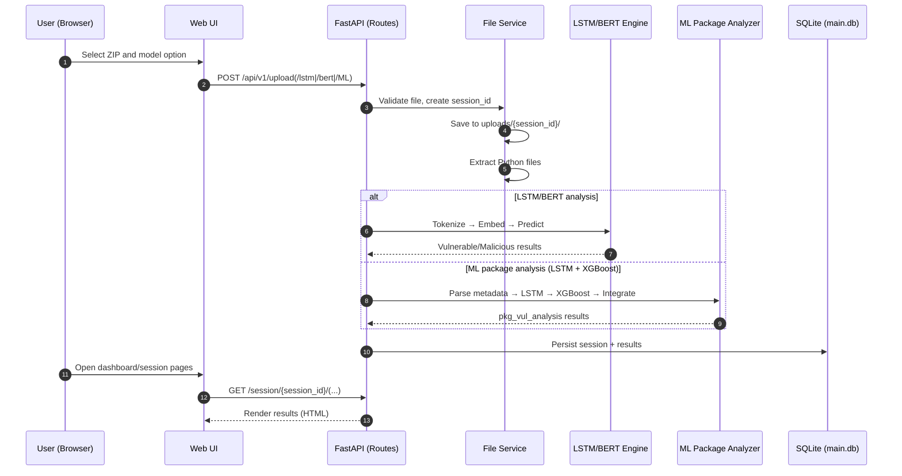
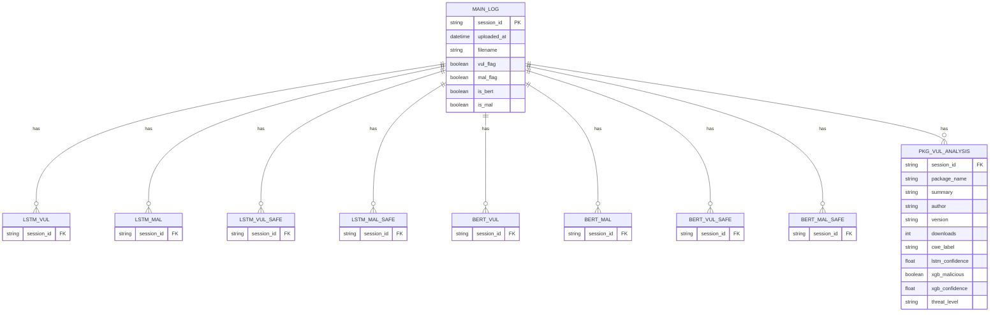

## PySecure Server Flow Charts (Mermaid)

A concise, step-by-step visualization of the PySecure server based on `pipeline.md`.

### 1) System Architecture (High Level)
```mermaid
graph LR
  A[Web UI<br/>(HTML/CSS/JS)] <--> B[FastAPI Server<br/>PySecure]
  B <--> C[AI Analysis Engine<br/>(LSTM / BERT / ML)]
  B <--> D[(SQLite DB<br/>main.db)]
```

### 2) End-to-End Upload & Analysis Flow


### 3) Server Internal Processing Pipeline
```mermaid
flowchart TD
  A[ZIP upload] --> B[Validate file (ext/size)]
  B --> C[Create session_id]
  C --> D[Save ZIP → uploads/{session_id}/]
  D --> E[Extract → extracted/*.py]
  E --> F{Model mode?}
  F -->|LSTM| G[Tokenize → Word2Vec → LSTM predict]
  F -->|BERT| H[Tokenize → CodeBERT → Predict]
  F -->|ML (LSTM+XGB)| I[Parse metadata → LSTM → XGBoost → Integrate]
  G --> J[Compose results]
  H --> J
  I --> J
  J --> K[Persist to SQLite]
  K --> L[Render via templates]
```

### 4) API Endpoints Overview
```mermaid
flowchart LR
  subgraph Pages
    A1[GET /]:::page
    A2[GET /session/{id}]:::page
    A3[GET /session/{id}/vulnerable]:::page
    A4[GET /session/{id}/malicious]:::page
    A5[GET /session/{id}/ML]:::page
  end

  subgraph REST API
    B1[POST /api/v1/upload]:::api
    B2[POST /api/v1/upload/lstm]:::api
    B3[POST /api/v1/upload/bert]:::api
    B4[POST /api/v1/upload/ML]:::api
    B5[GET /api/v1/sessions]:::api
    B6[GET /api/v1/sessions/{id}]:::api
    B7[GET /api/v1/source/{id}/{path}]:::api
    B8[GET /api/v1/sessions/ML/{id}]:::api
    B9[GET /api/v1/sessions/ML/{id}/summary]:::api
    B10[GET /api/v1/stats]:::api
    B11[GET /health]:::api
  end

  classDef page fill:#E3F2FD,stroke:#1E88E5,stroke-width:1px,color:#0D47A1;
  classDef api fill:#E8F5E9,stroke:#43A047,stroke-width:1px,color:#1B5E20;
```

### 5) Database Entities (Simplified)


### 6) ML Package Analysis (LSTM + XGBoost)
```mermaid
flowchart TD
  A[ZIP Upload] --> B[Extract package]
  B --> C[Parse metadata (name, version, desc...)]
  C --> D[LSTM (code signals)]
  C --> E[XGBoost (package features)]
  D --> F[Integrate results]
  E --> F
  F --> G[Write to PKG_VUL_ANALYSIS]
  G --> H[Expose via /session/{id}/ML]
```

### 7) Runtime & Performance
```mermaid
flowchart LR
  A[FastAPI App] --> B[Workers (3)]
  B --> C[Parallel analysis jobs]
  C --> D[Streaming I/O & memory-efficient loads]
  D --> E[Results → DB → UI]
```

---

Tips:
- Render locally with Mermaid preview extensions or any Markdown viewer supporting Mermaid.
- Use this file alongside `pipeline.md` for details and narrative descriptions.


