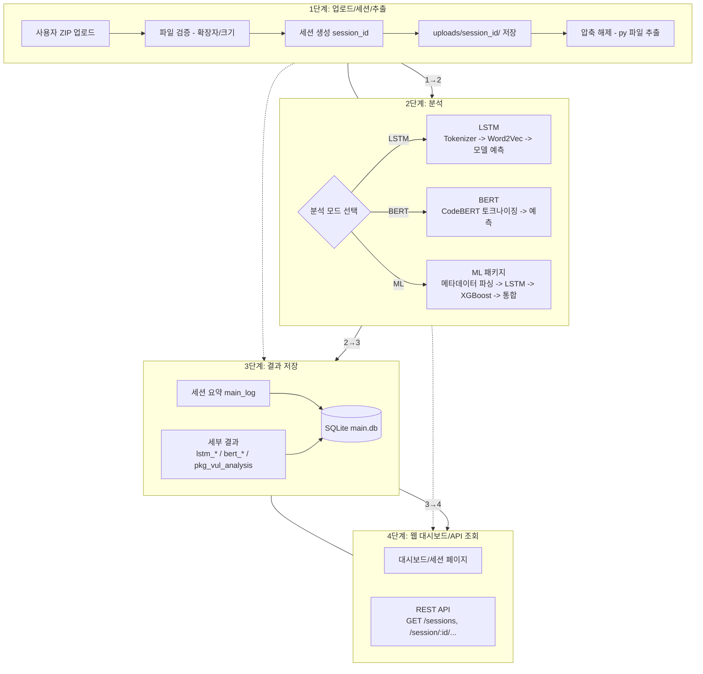

## PySecure 간단 파이프라인 (4단계)

`pipeline.md`와 제공하신 개념도를 바탕으로, 서버 전체 흐름을 4단계로 축약했습니다.

요약
- 1) 업로드·세션·추출: ZIP 업로드 → 검증 → session_id → 저장/추출
- 2) 분석: LSTM, BERT, 또는 ML(LSTM+XGBoost) 중 선택 수행
- 3) 결과 저장: `main_log`와 각 결과 테이블에 영구 저장
- 4) 시각화/조회: 대시보드와 REST API로 결과 확인

